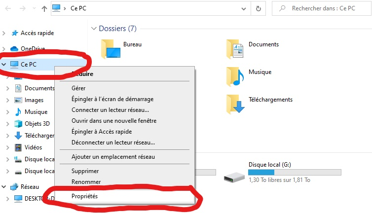
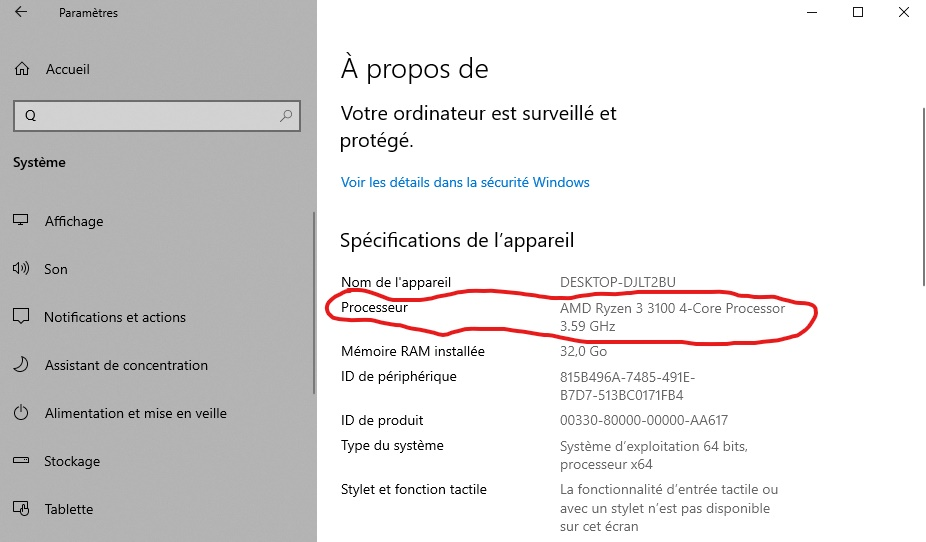
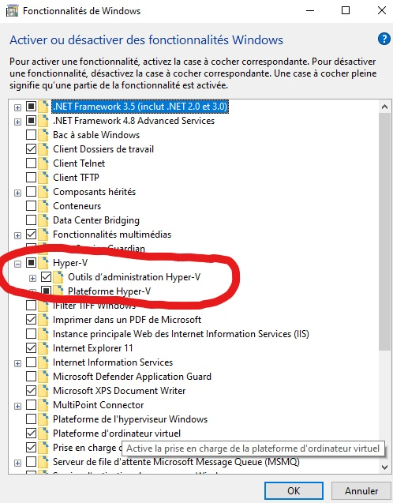
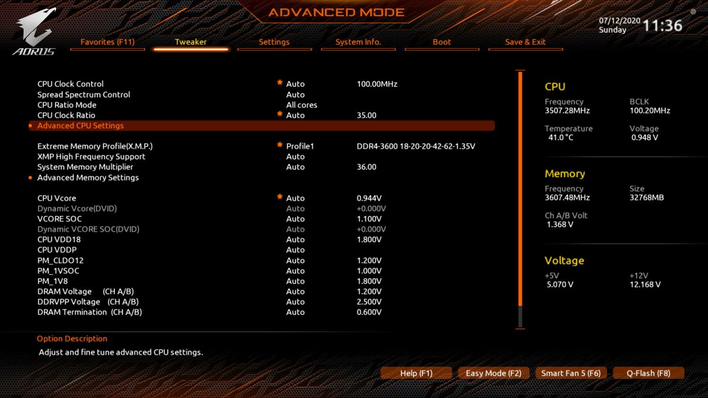
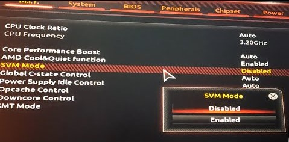
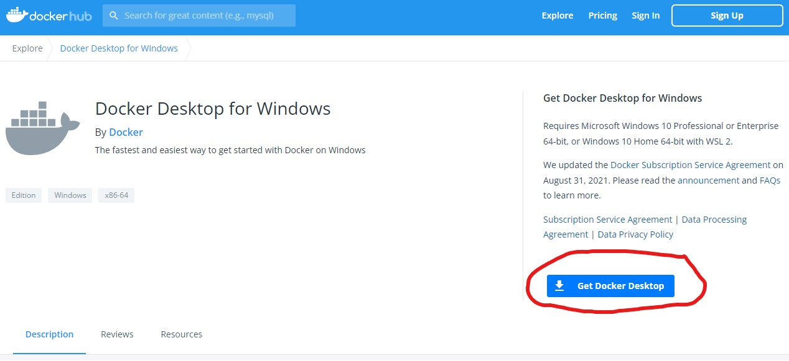
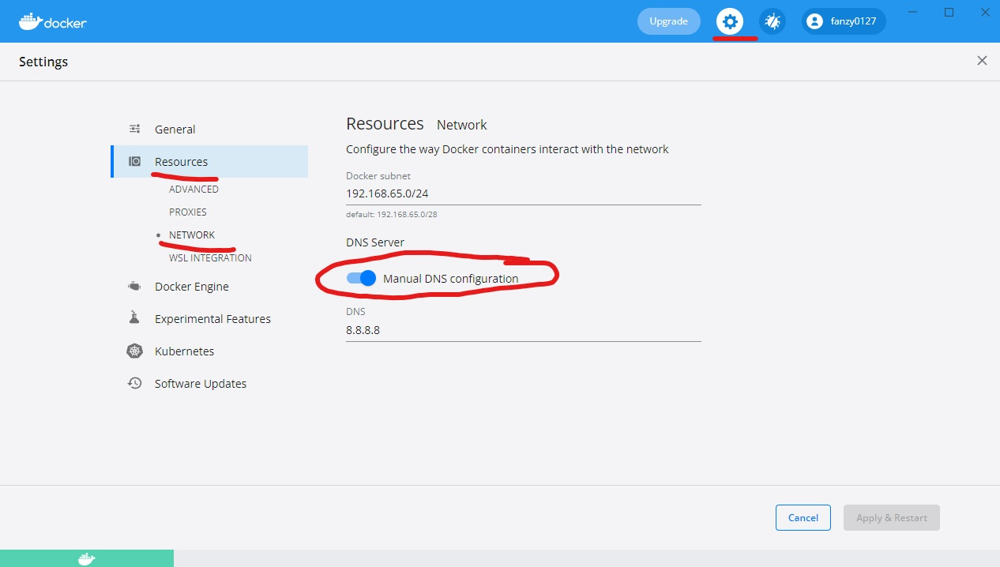

# Installation de Docker sur un environnement Windows

## Introduction

Docker est une application qui va vous permettre d'empaqueter des applications et ses dépendances dans un conteneur virtuel.
Conteneur que l'on pourra envoyer sur un serveur Linux, puis lancer sur n'importe quel serveur Linux par la suite.

Un conteneur peut être imaginé comme une boîte (un peu comme une machine virtuelle), qui va être complètement isolée du système d'exploitation (OS).
Dans cette boîte, on va pouvoir installer toutes les librairies nécessaires au fonctionnement de l'application, ainsi que l'application elle-même.
Vu que cette boîte est isolée du reste du système, elle va pouvoir être utilisée sur n'importe quel autre OS.

*À noter que le principe du conteneur n'a pas été inventé par Docker.
Linux possédait déjà un système de conteneur nommé LXC (Linux Container).*

## Intérêts de Docker

- **Gain de performances** :


Comme l'illustre le schéma ci-dessus, contrairement aux machines virtuelles (VM), Docker n'a pas besoin de virtualiser un OS pour chaque application.
Le système de conteneurs permet d'utiliser directement l'OS de l'hôte, et de ne pas virtualiser différents OS pour l'utilisation de nos applications.
De facto, en utilisant un seul OS au lieu d'en utiliser plusieurs, on gagne énormément en performances.

- **La portabilité** : contrairement à une VM, Docker est bien plus léger. 
- **Scalabilité** : les conteneurs de Docker vont facilement pouvoir être utilisés d'une machine à l'autre, et on va pouvoir les faire évoluer sans que cela ne pose de problèmes sur nos machines.
- **Facilité de déploiement** : vu que les conteneurs sont très légers, il est facilement envisageable d'envoyer un contenur abouti à un hébergeur qui va juste se charger de le faire fonctionner.

## Installation facile sous Windows

### 1. Installation de WLS2

Tout d'abord, nous allons installer WLS2 (Windows Subsystem for Linux 2), qui est une fonctionnalité de Windows permettant de lancer un fichier système Linux.
Cette étape est nécessaire au lancement de Docker Desktop.

**Prérequis :**

- Vous devez posséder Windows 10 versions 2004 et ultérieures (build 19041 et versions ultérieures) ou Windows 11.

Pour connaître votre version de Windows, cliquez sur **Windows + R** pour ouvrir l'exécutable de commandes windows, tapez **winver** et appuyez sur **OK**.
Vous pouvez mettre à jour la dernière version de Windows en sélectionnant **Démarrer** => **Paramètres** => **Paramètres de Windows Update** => *La recherche des mises à jour devrait se faire automatiquement*.

Une fois que vous êtes sûr d'avoir une version de Windows compatible, tapez dans votre PowerShell :

```bash
wsl --install
```

Si en tapant cette commande vous voyez le texte d'aide WSL, tapez :


```bash
wsl --list --online
```
Cela vous donnera accès à la liste des distributions Linux disponibles.
Puis enfin tapez :

```bash
wsl --install -d <DistroName>
```

Ainsi vous installerez la distribution de votre choix (pour ma part, je suis sous Ubuntu).

Si jamais vous souhaitez vous essayez à d'autres choses, comme par exemple lancer plusieurs distributions Linux, je vous mets le lien de la [documentation Windows de WSL](https://docs.microsoft.com/fr-fr/windows/wsl/install) à votre disposition.

### 2. Identification du processeur de la machine

*À noter qu'il va également falloir que vous sachiez si votre processeur est un Intel ou un AMD.
En effet, Docker nécessite l'autorisation de fonctionnement d'une mini-machine virtuelle sous Windows, car Docker a été conçu pour fonctionner sous environnement Linux.
Dans le cas de AMD, les VM sont moins bien supportées, et vous allez devoir autoriser leur utilisation depuis votre BIOS.*

*Pour connaître votre OS, faites un clic droit => Propriétés sur l'onglet PC de votre arborescence.*



*Vous devriez obtenir une page de spécifications ressemblant à ceci :*



Allez cocher les options relatives à l'**Hyper-V** dans les fonctionnalités Windows :



- Si vous constatez que votre processeur est un Intel, vous allez pouvoir passer directement à l'installation de Docker.

- Si votre processeur est un AMD, vous allez devoir redémarrer votre ordinateur et accéder à votre BIOS au redémarrage de celui-ci (la touche d'accès dépendant du constructeur, voici le lien qui vous permettra de trouver comment accéder à votre BIOS : [Liste des touches d'accès au BIOS](https://www.malekal.com/liste-touches-acces-bios-boot-menu-constructeur/)).

L'objectif va être d'aller dans les paramètres avancés de votre CPU. L'interface change d'un processeur à l'autre, mais voici un exemple :





Une fois que vous aurez autorisé (Enabled) les VM sur votre environnement, vous serez arrivé au même point ceux possédant un processeur Intel et vous pourrez commencer l'installation de Docker. 

### 3. Installation de Docker Desktop

Après tant de péripéties, vous voici enfin arrivé à la partie que vous attendiez, l'installation de **Docker** !

Pour ce faire, téléchargez [Docker Desktop Installer.exe](https://hub.docker.com/editions/community/docker-ce-desktop-windows/) en cliquant sur Get Docker Desktop :



Lancez le .exe en suivant les instructions, et voilà, enfin vous aurez installé Docker, prêt à l'emploi.

Juste au cas où, je vous mets à disposition le [lien de la documentation](https://docs.docker.com/desktop/windows/install/).

N'oubliez pas de vous créer un compte sur [Docker Hub](https://hub.docker.com/). Suite à cela, vous allez enfin avoir le plaisir de pouvoir travailler avec des conteneurs ainsi que des images Docker.

*Amusez-vous bien !*


*Petit pro tip :*

Étant donné que vous êtes sous environnement Windows, et que je suis un gars vraiment cool, je vous conseille fortement d'aller cocher cette option dans les Settings de Docker Desktop. ;)



Cela vous permettra à l'avenir de préfixer les chemins de vos volumes Docker de la manière suivante (avec le .\ en début de chemin):

```yml
volumes:
      - .\data:/data/db
```